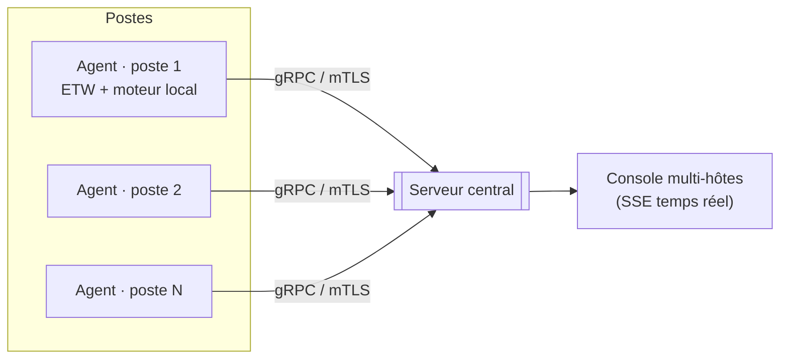

<div align="center">

# 🛡️ Sentinelle

**EDR (Endpoint Detection & Response) défensif, écrit en Rust.**
Détection par règles façon Sigma, corrélation par arbre de processus, console SOC
temps réel, et architecture de parc agent ↔ serveur en gRPC + mTLS.

[](https://github.com/Pazificateur69/sentinelle-edr/actions/workflows/ci.yml)


</div>

---

> **Honnêteté d'ingénierie.** Sentinelle est une **base de produit crédible et
> fonctionnelle**, pas un concurrent fini de CrowdStrike/SentinelOne. Égaler un
> leader demande des années, une équipe, du renseignement sur les menaces, et des
> accès réservés aux partenaires de Microsoft (MVI : processus protégé, anti-tamper
> noyau). Ce dépôt couvre la **chaîne complète** — capteur → détection →
> corrélation → score → réponse → console → parc — et documente précisément ce qui
> reste à faire. Le cœur (détection, règles, corrélation, scoring, import Sigma) est
> **testé** et multiplateforme ; le capteur ETW et le transport gRPC/mTLS **compilent en CI sur
> Windows et Linux** ; reste la validation à l'exécution (voir [Statut de vérification](#-statut-de-vérification)).

## ✨ Fonctionnalités

| | Fonctionnalité | Détail |
|---|---|---|
| 🔬 | **Moteur de détection** | opérateurs façon Sigma (`equals`/`contains`/`startswith`/`endswith`/`regex`), arbre booléen `and`/`or`/`not` |
| 🧬 | **Corrélation par ascendance** | détecte « PowerShell dont un *ancêtre* est Office », pas seulement le parent direct |
| 🧠 | **Détection comportementale** | rafale de créations de processus (seuil + fenêtre glissante), au-delà des règles unitaires |
| 🙈 | **Allowlist / suppression** | règles d'exception ciblées pour écraser les faux positifs (le défaut n°1 des EDR maison) |
| 🔁 | **Déduplication d'alertes** | une même (règle, hôte, pid) n'alerte qu'une fois par fenêtre — anti-bruit |
| 🎛️ | **Seuils réglables** | fenêtres de dédup & détecteurs comportementaux configurables par fichier TOML (`SENTINELLE_CONFIG`, voir `sentinelle.example.toml`) |
| 📜 | **Import de règles Sigma** | `.yml` Sigma appliqué directement ; modificateurs `contains`/`startswith`/`endswith`/`re`/`base64`/`windash`/`cidr`/`all`, condition `and`/`or`/`not` + quantificateurs ; champs non mappés rejetés explicitement |
| 📊 | **Scoring** | risque par hôte (accumulation + décroissance temporelle) ; pondération par **confiance** par règle (abaisser une règle bruyante sans changer sa sévérité) |
| 💾 | **Persistance (SQLite)** | historique d'alertes qui survit aux redémarrages + base interrogeable pour l'investigation (`SENTINELLE_DB`, optionnel) |
| 🖥️ | **Console SOC temps réel** | flux SSE, badges MITRE cliquables, **filtres par sévérité + recherche**, **répartition des sévérités**, ligne de commande & score, **couverture ATT&CK par tactique**, **mode démo** autonome ; 100 % embarquée |
| 🌐 | **Parc multi-postes** | agents → serveur central en **gRPC + mTLS bidirectionnel**, console multi-hôtes |
| ⚔️ | **Réponse** | terminaison de processus (Windows), en mono-poste **et à distance dans le parc** (ordre poussé à l'agent depuis la console) ; quarantaine & isolation WFP au backlog |
| 🧪 | **Simulation d'attaque** | rejoue une kill chain réaliste (Office → PowerShell → vol de secrets → ransomware) |

## 🚀 Démarrage rapide

### Mode mono-poste (le plus simple — marche partout)

```bash
cargo run --release -p sentinelle-agentd
# puis ouvrir http://localhost:8787 et cliquer « Simuler une attaque »
#
# avec historique persistant (SQLite) :
# SENTINELLE_DB=sentinelle.db cargo run --release -p sentinelle-agentd
```

Avec des règles Sigma en plus :

```bash
SENTINELLE_RULES_DIR=./rules.d cargo run --release -p sentinelle-agentd
```

### Mode parc (agent ↔ serveur, gRPC + mTLS)

```bash
# 1. Générer la PKI (CA + cert serveur + cert client) — pur Rust, pas d'openssl
cargo run -p sentinelle-certgen -- ./certs

# 2. Démarrer le serveur central (console sur http://localhost:8080)
cargo run --release -p sentinelle-server

# 3. Démarrer un ou plusieurs agents (chacun avec son nom d'hôte)
SENTINELLE_HOST=poste-compta  cargo run --release -p sentinelle-agent
SENTINELLE_HOST=poste-direction SENTINELLE_REPLAY_SECS=20 cargo run --release -p sentinelle-agent
```

La console du serveur montre alors **tous les postes** connectés et leur niveau de risque.



## 🏗️ Architecture

Workspace Cargo, 8 crates à responsabilité unique :

| Crate | Rôle |
|-------|------|
| `common` | **cœur pur, testé** : schéma d'événement, moteur de règles, arbre de processus, scoring, import Sigma, scénario |
| `sensor-windows` | capteur **ETW** (processus) + enrichissement ligne de commande |
| `console` | état partagé + console web temps réel (SSE) réutilisée par les deux modes |
| `agentd` | **mode mono-poste** : capteur → moteur → console + réponse, tout-en-un |
| `proto` | contrat **gRPC** (protobuf) + conversions avec les types internes |
| `server` | **serveur de parc** : ingestion gRPC/mTLS + console multi-hôtes |
| `agent` | **agent de parc** : collecte + détection locale → flux gRPC/mTLS |
| `certgen` | génère la mini-PKI (CA, cert serveur, cert client) pour le mTLS |

**Flux de détection** : `événement → arbre de processus (ascendance) → règles → alerte (score + ATT&CK) → console`.

Pourquoi ce découpage : `common` ne dépend d'aucune plateforme → il **se compile et
se teste partout** (macOS inclus), ce qui garde la logique de détection sous tests
rapides. Le capteur ETW et le transport gRPC/mTLS sont isolés dans leurs crates.

## 🎯 Détection

39 règles embarquées ([`crates/common/rules.json`](crates/common/rules.json)), mappées MITRE ATT&CK :
chaîne de macro Office (T1203/T1059), PowerShell encodé/furtif/download-cradle
(T1059.001, T1027), dump LSASS & mimikatz (T1003), suppression des *shadow copies*
& sabotage `bcdedit` (ransomware, T1490), persistance (Run key, tâches, services),
LOLBins (certutil, bitsadmin, rundll32), désactivation de Defender, **mouvement latéral** (PsExec, WMIC /node), **anti-forensic** (effacement des journaux, USN), **contournement UAC/AMSI**, désactivation du pare-feu, **accès LSASS par handle**, **injection par thread distant**, **tubes nommés de C2**, etc.

La couverture dépasse les processus : **réseau** (C2), **fichier** (note de rançon)
et **chargement d'image/driver** (détection **BYOVD** / « EDR killers »). S'ajoutent
découverte, vol d'identifiants, exfiltration, IFEO — couvrant les **10 tactiques**
ATT&CK du kill chain (vue par tactique dans la console). Deux **détections
comportementales** à états complètent les règles unitaires : `SNT-B001` (rafale de
créations de processus) et `SNT-B002` (chiffrement massif = rançongiciel), `SNT-B003` (**usurpation de parent / PPID spoofing**).
Enfin, une couche **allowlist + déduplication** contient les faux positifs et le bruit.

**Ajouter une détection** = ajouter une entrée JSON, ou déposer une règle Sigma dans
[`rules.d/`](rules.d/). Exemple fourni : [`rules.d/recon_discovery.yml`](rules.d/recon_discovery.yml).
**Réduire un faux positif** = une entrée dans [`crates/common/allowlist.json`](crates/common/allowlist.json)
ou un fichier pointé par `SENTINELLE_ALLOWLIST`.

## ⚖️ Où Sentinelle se distingue des EDR commerciaux

Sentinelle n'égale pas un leader sur la détection à l'échelle. Mais sur plusieurs
axes concrets, un EDR **open-source en Rust** est honnêtement **meilleur** :

- **Transparence totale** — règles ouvertes, détection versionnée comme du code, chaque alerte explicable (ascendance, ligne de commande, technique ATT&CK). Pas de boîte noire.
- **Sûreté mémoire** — agent en Rust ; l'incident CrowdStrike (2024) venait d'un driver C++. L'agent est lui-même moins une surface d'attaque.
- **Souveraineté** — 100 % on-prem, aucune donnée envoyée à un éditeur. Hébergement et contrôle chez vous.
- **Coût & liberté** — gratuit, modifiable, pas de licence par poste.
- **Auditable & réglable** — règles, allowlist et seuils en fichiers clairs ; contenu déployable progressivement (leçon CrowdStrike).

**Honnêtement** : là où comptent le renseignement sur les menaces mondial,
l'anti-tamper noyau (programme MVI) et une équipe SOC 24/7, un produit commercial
reste devant — et c'est structurel, pas une question d'effort.

## ✅ Statut de vérification

La **CI compile tout le workspace sur Ubuntu *et* Windows** et lance les tests à
chaque push (badge en haut). Autrement dit, le capteur ETW, le kill Win32 et le
parc gRPC/mTLS **compilent sur Windows** — ce n'est plus une promesse.

| Composant | État |
|-----------|------|
| Cœur de détection (règles, arbre, score, Sigma) | ✅ **36 tests unitaires**, verts en CI |
| Console + état + SSE (mode mono-poste) | ✅ compile & tourne (démo vérifiée) |
| Capteur ETW Windows | ✅ **compile en CI Windows** ; capture live à valider sur une vraie machine (admin) |
| Réponse `kill` (Win32) | ✅ **compile en CI Windows** ; effet à valider en conditions réelles |
| Parc gRPC + mTLS **bidirectionnel** + réponse à distance | ✅ **runtime validé en CI (Ubuntu + Windows)** : handshake mTLS mutuel, flux bidi, ingestion, ordre de kill routé au client (test d'intégration `tests/fleet.rs`) |

Le **runtime du parc** (handshake mTLS, streaming bidi, ingestion, routage d'un
ordre de kill) est désormais **validé en CI** par un test d'intégration qui monte
un vrai serveur et un vrai client. Ce qui reste à valider sur une **machine réelle**
se réduit à : ETW capturant réellement les processus (admin requis) et la
terminaison effective d'un processus cible.

## 🗺️ Feuille de route

1. Valider capteur ETW + parc gRPC/mTLS sur VM Windows
2. Sources ETW réseau + fichier + chargement d'images/DLL
3. ~~Persistance (SQLite)~~ ✅ **fait** (`SENTINELLE_DB`) ; rétention/purge automatique au backlog
4. Réponse : quarantaine fichier, isolation réseau (WFP)
5. Anti-tamper réaliste (détection d'arrêt d'agent, heartbeat) — *limite honnête : sans PPL, un admin peut tuer l'agent*
6. Classifieur ML statique d'exécutables (ONNX)
7. ~~Commandes serveur → agent~~ ✅ **fait** (kill à distance via la console du parc)

Revue d'architecture détaillée (fait / à-faire) : [`docs/ARCHITECTURE-REVIEW.md`](docs/ARCHITECTURE-REVIEW.md).

### Les pièges qui tuent un EDR maison (et comment on les évite)

- **Faux positifs** → règles mappées ATT&CK, sévérités calibrées, à mesurer contre [Atomic Red Team](https://github.com/redcanaryco/atomic-red-team)
- **Boucle de crash type CrowdStrike (2024)** → le contenu (règles) est analysé en *user-mode*, jamais dans un driver
- **Perf** → rafraîchissement ciblé par PID, files bornées, pas de scan système complet
- **L'agent comme surface d'attaque** → Rust (mémoire-sûr) sur tout le chemin

## 🧪 Tests

```bash
cargo test -p sentinelle-common   # 36 tests, multiplateforme, rapides
cargo build -p sentinelle-agentd  # mode mono-poste
```

## 📚 Documentation

- [Guide d'utilisation](docs/GUIDE.md) — installer, lancer (mono-poste & parc), écrire des règles, régler les seuils.
- [Revue d'architecture](docs/ARCHITECTURE-REVIEW.md) — fait / à-faire, par composant.
- [Changelog](docs/CHANGELOG.md).
- [Manques compétitifs & feuille de route de détection](docs/COMPETITIVE-GAPS.md) — priorisé (revue Codex).

## 📄 Licence

MIT — voir [LICENSE](LICENSE).

---

<div align="center">
<sub>Construit pour apprendre et défendre. Pas une promesse d'inviolabilité — un outil honnête, testé là où ça compte.</sub>
</div>
